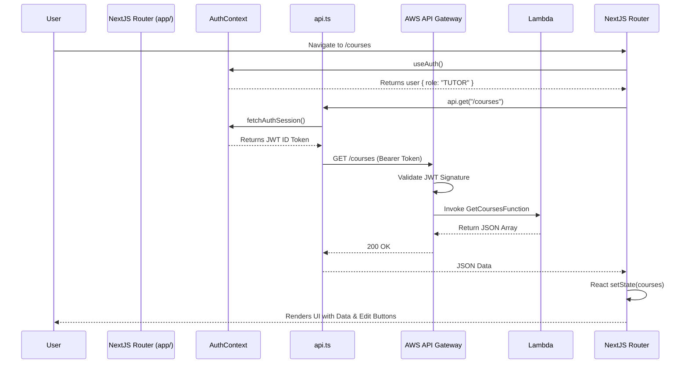
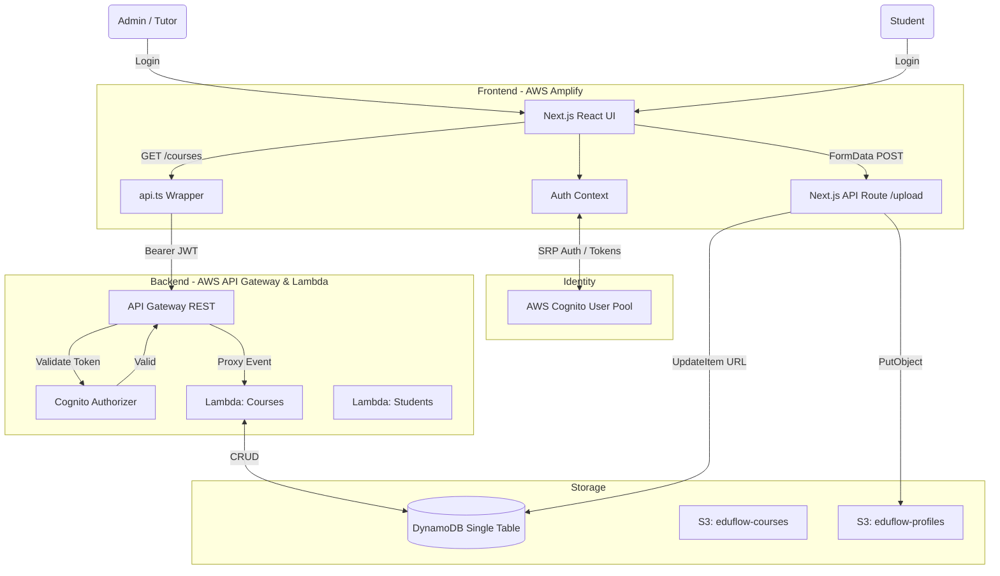

# EDUFLOW LMS - COMPLETE REPOSITORY REVERSE ENGINEERING & DEVELOPER BIBLE

This is the ultimate developer documentation for the EduFlow LMS project. It is written as a deep-dive mentoring guide. Read it from start to finish to understand every piece of the codebase, architecture, and design decisions without needing to blind-read the source code.

---

# SECTION 1: COMPLETE REPOSITORY TREE

This section walks through the entire EduFlowLMS folder structure, explaining why each directory exists, its responsibilities, and its dependencies.

### `/app`
* **Why it exists**: It is the root of the Next.js 15 App Router frontend. Next.js enforces the `app/` directory convention for file-system based routing.
* **Who created it**: Next.js scaffolding (via `create-next-app`), heavily modified by the engineering team.
* **What problem it solves**: Replaces the old `pages/` router, offering React Server Components (RSC) and nested layouts.
* **What depends on it**: The AWS Amplify Hosting service reads this to build the frontend.
* **What depends on it later**: End-users traversing the application URLs.
* **Belongs to**: Frontend.

### `/app/api`
* **Why it exists**: Houses Next.js server-side API Routes (Route Handlers).
* **Who created it**: The engineering team.
* **What problem it solves**: We needed a secure way to execute server-side logic from the frontend without exposing AWS credentials to the browser, specifically for S3 multipart uploads.
* **What depends on it**: Frontend components (like the Profile settings form and Course creation form) POST to these routes.
* **What depends on it later**: Depends on `lib/aws/s3.ts` to forward data to AWS S3.
* **Belongs to**: Frontend (SSR logic).

### `/app/auth` & `/app/login`
* **Why it exists**: Handles user identity presentation.
* **Who created it**: The engineering team.
* **What problem it solves**: Contains the complex, multi-step forms for Sign In, Sign Up, Verification, and Password Resets.
* **What depends on it**: Unauthenticated users.
* **What depends on it later**: Depends heavily on `AuthContext.tsx` and `@aws-amplify/auth` to trigger the actual Cognito flows.
* **Belongs to**: Frontend.

### `/app/components`
* **Why it exists**: Stores reusable React UI components.
* **Who created it**: The engineering team.
* **What problem it solves**: Prevents code duplication. Components like `sidebar.tsx` and `RoleGuard.tsx` are used across dozens of pages.
* **What depends on it**: Every major page in the `/app` directory.
* **What depends on it later**: Depends on `lucide-react` for icons and Tailwind CSS for styling.
* **Belongs to**: Frontend.

### `/app/context`
* **Why it exists**: Stores React Context providers for global state management.
* **Who created it**: The engineering team.
* **What problem it solves**: Propagating the authenticated user's state (tokens, role, email) to deeply nested components without "prop drilling".
* **What depends on it**: `app/layout.tsx` wraps the entire app in `<AuthProvider>`. Every protected route and API call depends on `useAuth()`.
* **What depends on it later**: Depends on AWS Amplify Auth module to fetch underlying session data.
* **Belongs to**: Frontend.

### `/backend`
* **Why it exists**: The root of the AWS Serverless Application Model (SAM) backend.
* **Who created it**: The engineering team.
* **What problem it solves**: Decouples the frontend from the database and core business logic. It provides a RESTful API via AWS API Gateway and Lambda.
* **What depends on it**: The Next.js frontend calls the endpoints deployed by this folder.
* **What depends on it later**: Depends on AWS CloudFormation during deployment.
* **Belongs to**: Backend / AWS Infrastructure.

### `/backend/src/handlers`
* **Why it exists**: Contains the actual Node.js logic for the Lambda functions.
* **Who created it**: The engineering team.
* **What problem it solves**: Maps HTTP methods (GET, POST, etc.) to DynamoDB database operations. Validates inputs, checks RBAC, and formats JSON responses.
* **What depends on it**: Executed strictly by AWS Lambda triggered by API Gateway.
* **What depends on it later**: Depends on `@aws-sdk/client-dynamodb` and `@aws-sdk/util-dynamodb` to communicate with the DB.
* **Belongs to**: Backend.

### `/lib`
* **Why it exists**: A utility belt of shared functions.
* **Who created it**: The engineering team.
* **What problem it solves**: Centralizes generic logic like custom fetch wrappers (`api.ts`), string formatting, and Role-Based Access Control logic (`rbac.ts`).
* **What depends on it**: Consumed globally by frontend pages and components.
* **Belongs to**: Shared Code (though mostly executed in Frontend).

### `/lib/aws`
* **Why it exists**: Centralizes all AWS SDK client instantiations for the Next.js runtime.
* **Who created it**: The engineering team during Phase 2 Migration.
* **What problem it solves**: Prevents creating multiple duplicate instances of S3 or Cognito clients. Configures the AWS SDK with the correct region and credentials.
* **What depends on it**: Next.js API routes (`/api/profile/upload`) and `AuthContext`.
* **Belongs to**: Frontend (SSR Integration).

### `/public`
* **Why it exists**: Standard Next.js directory for static assets.
* **Who created it**: Next.js scaffolding.
* **What problem it solves**: Serves SVGs (like `grid.svg`), favicons, and static images directly via HTTP without processing.
* **What depends on it**: Browser `` tags.
* **Belongs to**: Frontend.

### `/scripts` & `/scratch`
* **Why it exists**: Temporary workspaces and automated developer scripts.
* **Who created it**: The engineering team / AI assistants.
* **What problem it solves**: Used for running ad-hoc E2E tests (`test_api.js`), standardizing roles (`replace2.js`), and testing database queries without impacting production.
* **What depends on it**: Local developer workflows.
* **What depends on it later**: Ignored by git and production builds.
* **Belongs to**: Local Shared Tools.

---

# SECTION 2: FILE BY FILE EXPLANATION

This section breaks down every critical file in the repository. 

### `app/layout.tsx`
* **Purpose**: The absolute root of the React component tree.
* **Why it exists**: Required by Next.js App Router to define the `<html>` and `<body>` tags, import global CSS, and wrap the application in global providers.
* **Who imports it**: Next.js framework automatically imports and renders this around every page.
* **What imports it**: Nothing manually imports this.
* **Functions inside**: `RootLayout({ children })`
* **Dependencies**: `AuthContext.tsx`, `globals.css`.
* **Business Logic**: Wraps `{children}` inside `<AuthProvider>`, ensuring the Auth Context is initialized immediately upon app load.
* **Common mistakes**: Putting heavily dynamic, client-side logic directly in the layout, which ruins Next.js Server Components optimization.

### `app/page.tsx`
* **Purpose**: The public-facing landing page of EduFlow LMS.
* **Why it exists**: To serve the `/` route, explaining the product to unauthenticated users and providing a call-to-action to log in.
* **Who imports it**: Next.js Router.
* **Exported objects**: `LandingPage` default export.
* **Business Logic**: Purely presentational. It checks if a user is logged in (via `useAuth`) and optionally redirects to `/dashboard`, or displays marketing copy.

### `app/login/page.tsx`
* **Purpose**: The single entry point for user identity (Login, Registration, Verification, Forgot Password).
* **Why it exists**: Consolidates all authentication UI into a slick, Framer Motion-animated page with a split-screen design.
* **Functions inside**: `PremiumAuthPage()`, `handleSubmit()`, `getPasswordStrength()`.
* **Dependencies**: `AuthContext.tsx` (for the `login` function), `@aws-amplify/auth` (for `signUp`, `confirmSignUp`, `resetPassword`), `framer-motion`.
* **AWS Services Touched**: AWS Cognito (via Amplify SDK).
* **Business Logic**: Manages a local `mode` state (`login`, `register`, `verify`, `forgot`). Based on the mode, `handleSubmit` fires different Amplify Auth SDK functions.
* **Common mistakes**: Forgetting that `signUp` does not log the user in; it moves them to the `verify` state. Forgetting to pass `options.userAttributes['custom:role'] = 'STUDENT'` during sign-up.

### `app/context/AuthContext.tsx`
* **Purpose**: The beating heart of Frontend Authentication.
* **Why it exists**: Next.js React components need a synchronized way to know *who* is logged in, *what* their role is, and to retrieve their JWT token.
* **Who imports it**: Every protected page, `sidebar.tsx`, `RoleGuard.tsx`, `api.ts`.
* **Exported objects**: `AuthProvider`, `useAuth()`.
* **Interfaces**: `User { name, email, role, image }`, `AuthContextType`.
* **Data Flow**: On mount (`useEffect`), it calls `fetchAuthSession()` to read local storage. If a Cognito session exists, it parses the ID token for `custom:role` and `name`, sets the `user` state, and removes the `loading` flag.
* **Dependencies**: `aws-amplify`, `aws-amplify/auth`.
* **AWS Services Touched**: Cognito.
* **Common mistakes**: Using `getCurrentUser()` to get the role. `getCurrentUser()` only returns the `username`/`sub`. You *must* parse the JWT payload from `fetchAuthSession().tokens.idToken.payload` to get the actual claims.

### `lib/api.ts`
* **Purpose**: A universal wrapper over the native browser `fetch()` API.
* **Why it exists**: Instead of manually writing `headers: { Authorization: "Bearer ..." }` in 50 different places, this file intercepts all outbound requests, automatically asks `AuthContext` (or the Amplify SDK directly) for the current JWT ID token, and attaches it.
* **Who imports it**: Every frontend page that needs to talk to the backend (`courses/page.tsx`, `students/page.tsx`, etc.).
* **Data Flow**: `api.get("/courses")` -> Fetches Cognito Token -> Injects Header -> Calls API Gateway -> Returns JSON.
* **Dependencies**: `aws-amplify/auth`.
* **AWS Services Touched**: Communicates with API Gateway.
* **Common mistakes**: Passing relative URLs instead of resolving against `process.env.NEXT_PUBLIC_API_URL`.

### `lib/rbac.ts`
* **Purpose**: The source of truth for Role-Based Access Control strings.
* **Why it exists**: Prevents typos like `"Instructor"` vs `"TUTOR"` by providing an exported `ROLES` constant and a helper `hasRole()` function.
* **Who imports it**: `sidebar.tsx`, `RoleGuard.tsx`.
* **Functions inside**: `hasRole(userRole, allowedRolesArray)`.
* **Exported objects**: `ROLES = { ADMIN: "ADMIN", TUTOR: "TUTOR", STUDENT: "STUDENT" }`.
* **Common mistakes**: Forgetting to use `.toUpperCase()` when comparing roles, leading to silent authorization failures.

### `app/components/sidebar.tsx`
* **Purpose**: The left-hand navigation menu.
* **Why it exists**: Provides application navigation.
* **Who imports it**: Usually imported in a `DashboardLayout` or directly in protected pages.
* **Dependencies**: `lucide-react` for icons, `rbac.ts` for filtering.
* **Business Logic**: Iterates over an array of route objects. Each route has a `roles` array. It uses `useAuth()` to get the current user's role and filters the menu items so STUDENTS don't see the "Students" management tab.

### `app/components/RoleGuard.tsx`
* **Purpose**: A wrapper component to conditionally hide UI elements based on roles.
* **Why it exists**: If a Tutor is viewing a course, they should see an "Edit" button. A Student viewing the exact same page should not. `RoleGuard` wraps the "Edit" button.
* **Who imports it**: Pages with mixed permissions (`courses/page.tsx`).
* **Dependencies**: `AuthContext.tsx`.
* **Business Logic**: `if (!allowedRoles.includes(user.role)) return null; return <>{children}</>;`

### `app/settings/page.tsx`
* **Purpose**: User profile management.
* **Why it exists**: Users need a place to change their name, see their role, and upload a profile picture.
* **Data Flow**: User selects an image -> `FormData` created -> POST to `/api/profile/upload` -> Next.js uploads to S3 -> Returns S3 URL -> Frontend updates UI and `AuthContext`.
* **Dependencies**: `AuthContext.tsx`.

### `app/courses/page.tsx`
* **Purpose**: The primary Course Catalog and Course Management view.
* **Why it exists**: Core business requirement. Lists available courses.
* **What imports it**: Next.js Router (`/courses`).
* **Data Flow**: `useEffect` mounts -> calls `api.get('/courses')` -> sets `courses` state -> maps over courses to render cards.
* **API Calls**: GET, POST, PATCH, DELETE `/courses`.
* **Business Logic**: If the user is an ADMIN or TUTOR, it renders a "Create Course" button (wrapped in `RoleGuard`). Clicking a course opens a modal to view or edit it.

### `app/students/page.tsx`
* **Purpose**: Admin/Tutor view to manage enrolled students.
* **Why it exists**: Educators need to track student progress and platform administrators need to manage user accounts.
* **API Calls**: GET `/students`.
* **Dependencies**: `api.ts`.

### `backend/template.yaml`
* **Purpose**: The AWS SAM Infrastructure as Code (IaC) blueprint.
* **Why it exists**: Defines every AWS resource the backend needs (API Gateway, Lambdas, Roles, Policies) in YAML format. It tells AWS CloudFormation exactly what to build.
* **Who imports it**: Processed by the AWS SAM CLI (`sam build` and `sam deploy`).
* **Exported objects**: CloudFormation Resources (e.g., `GetCoursesFunction`, `EduFlowApi`).
* **AWS Services Touched**: CloudFormation, Lambda, API Gateway, IAM.
* **Business Logic**: Maps API Gateway routes (`/courses`) to specific Lambda handler code (`src/handlers/courses.handler`). It also attaches a Cognito Authorizer (`EduFlowCognitoAuthorizer`) to the API Gateway.
* **Common mistakes**: Forgetting to update `Events` in `template.yaml` when adding a new HTTP method (like adding a `PATCH` route but forgetting to declare it in the YAML).

### `backend/src/handlers/courses.js`
* **Purpose**: The Lambda function that processes all `/courses` HTTP requests.
* **Why it exists**: It is the backend business logic for courses.
* **Who imports it**: AWS Lambda executes it.
* **Functions inside**: `handler(event)`
* **Data Flow**: 
  1. API Gateway passes `event`.
  2. `handler` parses `event.httpMethod` (GET, POST, PATCH, DELETE).
  3. Extracts the user's role from `event.requestContext.authorizer.claims['custom:role']`.
  4. Runs `hasRole(role, ["ADMIN", "TUTOR"])` for mutations.
  5. Parses `event.body` for POST/PATCH.
  6. Executes `DynamoDBClient` commands (e.g., `PutCommand`).
  7. Returns `{ statusCode: 200, body: JSON.stringify(...) }`.
* **Dependencies**: `@aws-sdk/client-dynamodb`, `@aws-sdk/lib-dynamodb`.
* **AWS Services Touched**: DynamoDB.
* **Common mistakes**: Not stringifying the `body` in the response, resulting in a 502 Bad Gateway from API Gateway.

### `lib/aws/s3.ts`
* **Purpose**: A strictly typed wrapper around AWS S3 operations.
* **Why it exists**: Simplifies multipart uploads to S3 from the Next.js server.
* **Who imports it**: `app/api/profile/upload/route.ts` and `app/api/courses/upload/route.ts`.
* **Functions inside**: `uploadToS3(buffer, fileName, contentType, bucketName)`.
* **Dependencies**: `@aws-sdk/client-s3`, `@aws-sdk/lib-storage`.
* **AWS Services Touched**: Amazon S3.
* **Business Logic**: Uses `Upload` from `@aws-sdk/lib-storage` to stream buffers directly to S3 without saving them to the local disk (crucial for serverless SSR environments).
* **Common mistakes**: Masking errors inside the `catch` block (e.g., `throw new Error("Failed")`), which hides critical AWS IAM credential errors like "Could not load credentials". Always throw `error.message`.
# SECTION 3: REACT PAGE EXECUTION & DATA FLOW

This section details exactly how data moves from the browser through the React lifecycle for a typical protected page like `/courses/page.tsx`.

### Execution Flow: Course Catalog (`/courses/page.tsx`)

1. **Routing**: The user navigates to `/courses`. Next.js App Router matches the file `app/courses/page.tsx`.
2. **Layout Initialization**: Before the page renders, `app/layout.tsx` wraps the request in `<AuthProvider>`. 
3. **Context Execution (`useAuth`)**: The page component calls `const { user, loading, getToken } = useAuth()`. If `loading` is true, the page returns a skeleton loader. 
4. **Effect Hook (`useEffect`)**: Once `loading` is false and `user` exists, a `useEffect` hook fires to fetch the initial data:
   ```javascript
   useEffect(() => {
     api.get('/courses').then(setCourses).catch(setError);
   }, []);
   ```
5. **API Interception (`api.ts`)**: The `api.get()` function asks `AuthContext` for the current JWT token. It attaches `Authorization: Bearer <TOKEN>` to the headers and executes a native browser `fetch()` to `NEXT_PUBLIC_API_URL/courses`.
6. **AWS Reception**: The request hits AWS API Gateway.
7. **Response Parsing**: The API Gateway returns a JSON array. The `api.ts` wrapper parses `res.json()` and resolves the Promise.
8. **UI Update**: `setCourses(data)` triggers a React re-render. The page maps over the `courses` state array, rendering a `<CourseCard>` for each item.
9. **RoleGuard Execution**: For each course, a `<RoleGuard allowedRoles={[ROLES.ADMIN, ROLES.TUTOR]}>` component wraps the "Edit" and "Delete" buttons. It checks the `user.role` from the Context. If the user is a `STUDENT`, it silently returns `null`, hiding the buttons.

### Sequence Diagram: Protected Page Load



---

# SECTION 4: COMPLETE BACKEND LAMBDA EXPLANATION

This section covers every Lambda function inside the AWS SAM Backend.

All Lambdas follow a strict pattern:
1. **Event Object**: AWS API Gateway passes an `event` object containing `httpMethod`, `body` (stringified), `pathParameters`, and `requestContext.authorizer.claims`.
2. **JWT Parsing**: API Gateway automatically parses the JWT. We do not write code to verify the signature in Lambda. We simply extract claims: `const claims = event.requestContext.authorizer.claims;`.
3. **RBAC**: We check `claims["custom:role"]` against the required roles for that HTTP method.
4. **DynamoDB Queries**: We instantiate `@aws-sdk/client-dynamodb` and perform the requested operation.
5. **Response**: We return an object `{ statusCode, headers, body }`. 

### `courses.js`
* **HTTP Methods Supported**: `GET`, `POST`, `PATCH`, `DELETE`.
* **Request Parsing**: `const body = JSON.parse(event.body || "{}");`. `const { id } = event.pathParameters || {};`.
* **RBAC**: `GET` allows `ADMIN`, `TUTOR`, `STUDENT`. `POST`/`PATCH`/`DELETE` require `ADMIN` or `TUTOR`.
* **DynamoDB Queries**:
  * GET: `ScanCommand` filtering where `SK = METADATA` and `PK begins_with COURSE#`.
  * POST: `PutCommand` with `PK = COURSE#<uuid>`, `SK = METADATA`.
  * PATCH: `UpdateCommand` using `UpdateExpression: "SET #title = :title..."`.
  * DELETE: `DeleteCommand` matching the exact `PK` and `SK`.
* **Validation**: Basic destructuring. If `title` is missing on POST, returns `400 Bad Request`.
* **Error Handling**: Wrapped in a `try/catch`. All errors `console.error` (for CloudWatch) and return a `500` status with `{ error: "Internal Server Error" }`.

### `students.js`
* **HTTP Methods Supported**: `GET`, `DELETE`.
* **RBAC**: Requires `ADMIN` or `TUTOR`. Students cannot list other students.
* **DynamoDB Queries**: 
  * GET: Scans for `PK begins_with USER#` and `role = STUDENT`.
* **Validation**: Checks if caller has proper role.

### `enrollments.js`
* **HTTP Methods Supported**: `POST`, `GET`, `DELETE`.
* **RBAC**: `POST` (Enroll) can be done by `STUDENT`. `DELETE` can be done by `ADMIN`/`TUTOR` or the `STUDENT` themselves.
* **DynamoDB Queries**:
  * POST: `PutCommand` with `PK = USER#<email>`, `SK = ENROLL#COURSE#<courseId>`.
  * GET: `QueryCommand` where `PK = USER#<email>` AND `SK begins_with ENROLL#`.

### `quizzes.js` & `assignments.js`
* **HTTP Methods Supported**: `GET`, `POST`.
* **RBAC**: `POST` (Create Quiz) requires `ADMIN` or `TUTOR`. `GET` is open to enrolled `STUDENT`s.
* **DynamoDB Queries**: Stored with `PK = COURSE#<id>` and `SK = QUIZ#<uuid>`.

### API Gateway Invocation
AWS API Gateway uses **Lambda Proxy Integration**. This means API Gateway does not modify the request body or response. It passes the raw HTTP request directly into the Lambda `event`, and expects the Lambda to return a perfectly formed HTTP response object (including CORS headers).

---

# SECTION 5: COMPLETE AWS ARCHITECTURE

This section explains every AWS service used, why it was chosen, and how it interacts with the rest of the stack.

### 1. AWS Amplify Hosting
* **What it is**: A managed hosting service for frontend web apps, similar to Vercel or Netlify.
* **Why we use it**: It natively supports Next.js 15 App Router Server-Side Rendering (SSR). It automatically connects to GitHub and builds the app whenever we push code to the `aws-phase2-cognito` branch.
* **Alternatives**: Vercel, AWS ECS, EC2.
* **Interaction**: Builds our code, hosts the static assets on a CDN, and spins up tiny Lambda@Edge functions to handle Next.js SSR routes (`/api/profile/upload`).

### 2. Amazon Cognito (User Pools)
* **What it is**: AWS's managed Identity Provider (IdP).
* **Why we use it**: It replaced NextAuth + PostgreSQL. Managing passwords, hashing, JWT signing, and email verification manually is a massive security risk. Cognito handles all of this securely out-of-the-box.
* **Interaction**: The frontend Amplify SDK talks directly to Cognito using SRP (Secure Remote Password). Cognito issues JWTs. API Gateway talks to Cognito to validate those JWTs.

### 3. AWS API Gateway (REST API)
* **What it is**: A fully managed service that makes it easy for developers to create, publish, maintain, monitor, and secure APIs.
* **Why we use it**: It acts as the "front door" to our Lambda functions. It handles rate limiting, CORS configuration, and JWT authorization before our code even executes.
* **Interaction**: Receives HTTPS requests from the frontend, validates the `Authorization: Bearer <token>` against Cognito, and triggers Lambda.

### 4. AWS Lambda
* **What it is**: Serverless compute. You upload Node.js code, and AWS runs it when triggered.
* **Why we use it**: Zero server maintenance. It scales automatically to handle 10,000 concurrent requests, and scales down to zero (meaning we pay $0) when no one is using the LMS.
* **Alternatives**: Express.js on EC2, Docker containers on Fargate.
* **Interaction**: Executed by API Gateway. Talks to DynamoDB.

### 5. Amazon DynamoDB
* **What it is**: A fully managed, serverless, NoSQL database designed for single-digit millisecond performance at any scale.
* **Why we use it**: Replaced Prisma/Postgres because traditional relational databases do not scale well with Serverless Lambda architectures (due to connection limits).
* **Interaction**: Lambdas query and mutate data here using the AWS SDK.

### 6. Amazon S3 (Simple Storage Service)
* **What it is**: Object storage built to store and retrieve any amount of data from anywhere.
* **Why we use it**: Databases (DynamoDB) are expensive and inefficient for storing large binary files like images or videos. S3 is practically free and infinitely scalable for files.
* **Interaction**: The Next.js SSR backend streams user uploads directly into S3. The frontend `` fetches directly from the S3 bucket.

### 7. AWS SAM (Serverless Application Model) & CloudFormation
* **What it is**: Infrastructure as Code (IaC). `template.yaml` is a SAM template.
* **Why we use it**: Instead of clicking around the AWS Console to create Lambdas and API Gateways (which is prone to human error and cannot be version-controlled), we define our entire backend infrastructure in code. `sam deploy` translates SAM syntax into CloudFormation, which provisions the resources.

### 8. AWS IAM (Identity and Access Management)
* **What it is**: The security framework of AWS.
* **Execution Roles**: Every Lambda function has an "Execution Role". This role contains a policy saying "I am allowed to write to DynamoDB table EduFlow-LMS-Data-USE1". If a Lambda tries to do something it doesn't have an IAM policy for, AWS blocks it instantly.
* **AmplifySSRLoggingRole**: The IAM role assigned to the Next.js SSR runtime in Amplify. We attached an S3 permissions policy to this role so Next.js is authorized to push files to our upload buckets.

### 9. CloudWatch
* **What it is**: AWS's monitoring and logging service.
* **Why we use it**: Whenever we write `console.log()` or `console.error()` in our Lambda functions, the output is permanently saved in CloudWatch Logs. It is our primary tool for debugging backend crashes.

### 10. Environment Variables
* **What it is**: Key-value pairs configured in Amplify and Lambda.
* **Why we use it**: To keep secrets out of source code. 
* **Interaction**: Amplify injects `NEXT_PUBLIC_COGNITO_USER_POOL_ID` during the build phase. Lambda injects `DYNAMODB_TABLE_NAME` into `process.env` at runtime.
# SECTION 6: AUTHENTICATION FLOW IN DEPTH

This section explains exactly what happens when a user logs in, how tokens are managed, and how the backend trusts the frontend.

### The Complete Login Flow
1. **User types email and password** on the `/login` page and clicks submit.
2. **Browser to Amplify SDK**: `app/login/page.tsx` calls `login({ email, password })` from `AuthContext.tsx`.
3. **Amplify to Cognito**: The `signIn` function uses the SRP (Secure Remote Password) protocol. It does NOT send the plaintext password over the wire. Instead, it sends cryptographic proofs.
4. **Cognito Validates**: Cognito verifies the SRP proofs. If correct, it generates a JWT token payload.
5. **JWTs Issued**: Cognito returns three distinct JWTs to the browser:
   * **ID Token**: Contains the user's identity claims (email, name, sub, and crucially, our `custom:role` attribute).
   * **Access Token**: Contains OAuth 2.0 scopes authorizing the client to act on behalf of the user. (We don't heavily use this; we use the ID token).
   * **Refresh Token**: A long-lived token (valid for 30 days) used to silently request new ID/Access tokens when they expire (every 1 hour).
6. **Token Storage**: The Amplify SDK automatically saves these tokens in the browser's `localStorage` or `sessionStorage` (depending on configuration). You should never read these manually from storage.
7. **AuthContext Hydration**: The React Context calls `fetchAuthSession()` to retrieve the tokens in memory. It decodes the ID Token payload and extracts the `custom:role`. It stores `{ email, role: "TUTOR" }` in the global state, allowing the UI to re-render (e.g., showing the Tutor dashboard).
8. **Making an API Call**: When the user navigates to `/courses`, `lib/api.ts` intercepts the request. It calls `fetchAuthSession()` (which automatically uses the Refresh Token if the ID token expired!), grabs the fresh ID Token string, and attaches it as `Authorization: Bearer eyJhbG...`.
9. **API Gateway Validation**: The request hits AWS API Gateway. Before triggering Lambda, the Cognito Authorizer kicks in. It downloads Cognito's public keys (JWKS), verifies the cryptographic signature of the JWT, checks that it hasn't expired, and ensures it was issued by our User Pool. If invalid, it returns `401 Unauthorized` instantly.
10. **Lambda RBAC Execution**: API Gateway passes the successfully decoded claims into `event.requestContext.authorizer.claims`. The Lambda runs `hasRole()` to check if `claims['custom:role']` is allowed.
11. **Response**: The Lambda returns data back to the user.

### Important Token Concepts
* **custom:role**: When a user registers, we pass `options.userAttributes['custom:role'] = 'STUDENT'`. This writes a custom attribute to their Cognito profile. When Cognito issues the ID Token, it bakes this attribute into the JSON payload.
* **Expiration**: ID tokens expire in 1 hour. This limits the damage if a token is stolen.
* **Refresh Tokens**: When `fetchAuthSession()` runs, if the ID token is expired, Amplify silently sends the Refresh Token to Cognito to get a new ID token. This keeps the user logged in for 30 days without typing their password again.

---

# SECTION 7: AUTHORIZATION (RBAC)

Authentication asks "Who are you?" (Cognito). Authorization asks "Are you allowed to do this?" (RBAC).

We use a dual-layer RBAC architecture.

### The Roles
* `ADMIN`: Platform owner. Can do anything.
* `TUTOR`: Content creator. Can manage courses and view students.
* `STUDENT`: End user. Read-only access to courses.

### Layer 1: Frontend Rendering (Cosmetic Security)
In the frontend, we use `RoleGuard.tsx` to conditionally render UI.
```tsx
<RoleGuard allowedRoles={[ROLES.ADMIN, ROLES.TUTOR]}>
  <button onClick={createCourse}>Create New Course</button>
</RoleGuard>
```
* **Why it's necessary**: UX. We don't want a student seeing a "Create Course" button that will just throw an error if they click it.
* **Why it's NOT real security**: A malicious student can open Chrome DevTools, modify the React State to change their role to `ADMIN`, and make the button appear.

### Layer 2: Backend Validation (Hard Security)
In the backend Lambda (`courses.js`):
```javascript
const claims = event.requestContext?.authorizer?.claims || {};
const role = claims["custom:role"] || "STUDENT";

if (event.httpMethod === "POST") {
  if (!hasRole(role, ["ADMIN", "TUTOR"])) {
    return { statusCode: 403, body: JSON.stringify({ error: "Forbidden" }) };
  }
  // Proceed with creation
}
```
* **Why it's necessary**: True security. The user cannot spoof the `custom:role` in the backend because the JWT signature is cryptographically generated by AWS Cognito. If they tamper with the JWT payload in their browser, API Gateway will reject the signature and return 401 before Lambda even executes.
* **Result**: Even if the student un-hides the "Create Course" button, the resulting `POST /courses` API call will be rejected with `403 Forbidden` by the backend.

---

# SECTION 8: DATABASE DESIGN

EduFlow completely avoids relational databases (PostgreSQL/MySQL) in favor of Amazon DynamoDB to ensure maximum serverless scalability.

### Why Single-Table Design?
In DynamoDB, joins do not exist. Fetching data across multiple tables is slow and expensive. Therefore, we store **all** entities (Users, Courses, Enrollments, Activities) in a single table: `EduFlow-LMS-Data-USE1`. 

We differentiate items using a combination of a Partition Key (PK) and a Sort Key (SK).

### Access Patterns & Entities

#### 1. User Profile
* **PK**: `USER#<email>` (e.g., `USER#admin@eduflow.com`)
* **SK**: `PROFILE`
* **Attributes**: `name`, `role`, `image`
* **Access Pattern**: To get a user's profile, we `GetItem` with PK and SK.

#### 2. Course Record
* **PK**: `COURSE#<uuid>` (e.g., `COURSE#9c8b8724...`)
* **SK**: `METADATA`
* **Attributes**: `title`, `description`, `category`, `price`, `thumbnail`, `instructorId`, `createdAt`
* **Access Pattern**: To list all courses, we use a `ScanCommand` with `FilterExpression: begins_with(PK, "COURSE#") AND SK = "METADATA"`. (In a massive production environment, we would use a Global Secondary Index (GSI) for this instead of a Scan).

#### 3. Enrollment
* **PK**: `USER#<student_email>`
* **SK**: `ENROLL#COURSE#<course_uuid>`
* **Attributes**: `enrolledAt`, `progress`
* **Access Pattern**: To see all courses a student is enrolled in, we `QueryCommand` where `PK = USER#<email> AND begins_with(SK, "ENROLL#")`. This is incredibly fast and efficient.

#### 4. Activity Log
* **PK**: `ACTIVITY`
* **SK**: `DATE#<iso_timestamp>`
* **Attributes**: `type`, `message`, `icon`
* **Access Pattern**: To get the recent activity feed, we `QueryCommand` where `PK = ACTIVITY`, `ScanIndexForward = false` (descending order), and `Limit = 10`.

This design ensures that reading data takes less than 10 milliseconds, regardless of whether the table has 10 records or 10 million records.
# SECTION 9: COMPLETE API DOCUMENTATION

This section documents every endpoint in the serverless API Gateway. All routes are prefixed with `https://lsbvzcesa2.execute-api.us-east-1.amazonaws.com/Prod`.

### 1. `GET /courses`
* **Purpose**: Fetches the list of all available courses in the catalog.
* **Authentication**: Requires valid Cognito JWT in `Authorization` header.
* **Who can call it**: `ADMIN`, `TUTOR`, `STUDENT`.
* **Lambda**: `GetCoursesFunction` (`src/handlers/courses.js`).
* **DynamoDB Operation**: `ScanCommand` on `SK = METADATA`.
* **Expected Errors**: `401 Unauthorized` if token missing/expired.

### 2. `POST /courses`
* **Purpose**: Creates a new course.
* **Authentication**: Requires valid Cognito JWT.
* **Who can call it**: `ADMIN`, `TUTOR`.
* **Request Body**: `{ title, description, category, price, thumbnail? }`
* **Lambda**: `GetCoursesFunction` (`src/handlers/courses.js`).
* **DynamoDB Operation**: `PutCommand` with `PK = COURSE#<uuid>`.
* **Expected Errors**: `403 Forbidden` if STUDENT attempts. `400 Bad Request` if `title` is omitted.

### 3. `PATCH /courses/{id}`
* **Purpose**: Edits an existing course.
* **Who can call it**: `ADMIN`, `TUTOR`.
* **DynamoDB Operation**: `UpdateCommand`.

### 4. `DELETE /courses/{id}`
* **Purpose**: Permanently removes a course.
* **Who can call it**: `ADMIN`, `TUTOR`.
* **DynamoDB Operation**: `DeleteCommand`.

### 5. `GET /students`
* **Purpose**: Lists all student accounts (for tutors to manage).
* **Who can call it**: `ADMIN`, `TUTOR`.
* **Lambda**: `GetStudentsFunction` (`src/handlers/students.js`).
* **DynamoDB Operation**: `ScanCommand` for `SK = PROFILE` and `role = STUDENT`.
* **Expected Errors**: `403 Forbidden` if called by a `STUDENT`.

*(Other entities like `/enrollments`, `/assignments`, and `/quizzes` follow the exact same CRUD pattern and RBAC definitions).*

---

# SECTION 10: COMPLETE UPLOAD FLOWS

EduFlow relies heavily on image uploads (Profile pictures and Course thumbnails). We use a **Direct-to-S3 via Next.js SSR** architecture. 

### Why this architecture?
If the browser talks directly to S3, we have to expose AWS credentials in the frontend (massive security flaw) or create complex presigned URL generators in API Gateway. Instead, the browser sends the image to our Next.js backend, which securely pushes it to S3 using environment variables that the user cannot see.

### The Flow: Profile Image Upload

1. **User Selection**: The user selects a `.jpg` on `app/settings/page.tsx`.
2. **Browser Submit**: The browser packages the file into a `FormData` object and executes a `POST` request to `/api/profile/upload`. It includes the Cognito JWT token.
3. **Next.js API Route Activation**: The code in `app/api/profile/upload/route.ts` wakes up.
4. **Validation**: The Next.js code parses the JWT to ensure the user is logged in. It extracts the file from the `FormData`, verifies it is an image, and verifies it is under 5MB.
5. **Buffer Conversion**: The `File` object is converted into a Node.js `Buffer`.
6. **AWS S3 Push**: The code calls `uploadToS3(buffer, ...)` from `lib/aws/s3.ts`. This uses `@aws-sdk/lib-storage` to stream the buffer securely to the `eduflow-profiles` S3 bucket.
7. **URL Generation**: S3 responds successfully, and we construct the public URL: `https://eduflow-profiles.s3.amazonaws.com/<uuid>.jpg`.
8. **DynamoDB Update**: The Next.js route uses `lib/aws/dynamo.ts` to execute an `UpdateCommand`, setting the user's `image` attribute in DynamoDB to the new URL.
9. **Response**: Next.js returns `200 OK` with the new URL.
10. **Browser Refresh**: `AuthContext.updateUser({ image: url })` is called, and the UI instantly updates with the new avatar.

### Files Involved
* `app/settings/page.tsx` (Frontend trigger)
* `app/api/profile/upload/route.ts` (Next.js SSR controller)
* `lib/aws/s3.ts` (S3 SDK wrapper)
* `lib/aws/dynamo.ts` (DB update wrapper)

*(The Course Thumbnail upload follows the identical flow, routed through `app/api/courses/upload/route.ts` to the `eduflow-courses` bucket).*

---

# SECTION 11: COMPLETE DEPLOYMENT WORKFLOW

Deployments in EduFlow are bifurcated into Frontend and Backend. They are decoupled and deployed via separate mechanisms.

### Frontend Deployment (AWS Amplify)
The frontend uses a standard GitOps CI/CD pipeline managed by AWS Amplify.
1. **Git Push**: A developer merges code into the `aws-phase2-cognito` branch and pushes to GitHub.
2. **Amplify Webhook**: GitHub notifies AWS Amplify.
3. **Provisioning**: Amplify spins up an Amazon Linux build container.
4. **Build Phase**: It reads `amplify.yml`. It installs Node modules (`npm install`) and builds the Next.js app (`npm run build`). Crucially, it injects environment variables stored in the Amplify Console.
5. **Deployment**: Static assets (`/public`, CSS, JS) are distributed globally via AWS CloudFront CDN. SSR Routes (`/api/upload`) are wrapped in Lambda@Edge functions.
6. **Live**: The app is instantly available at the Amplify URL.

### Backend Deployment (AWS SAM)
The backend does NOT deploy automatically via Git Push. It requires a manual SAM (Serverless Application Model) deployment from a developer's CLI or a separate GitHub Action pipeline.
1. **SAM Build**: The developer runs `sam build` inside the `/backend` folder. AWS SAM runs `npm install` and `esbuild` for every Lambda function, creating optimized ZIP artifacts.
2. **SAM Deploy**: The developer runs `sam deploy`.
3. **CloudFormation**: SAM uploads the ZIPs to a hidden S3 bucket and submits `template.yaml` to AWS CloudFormation.
4. **Infrastructure Updates**: CloudFormation compares the new YAML to the existing infrastructure. It provisions new API Gateway routes, updates Lambda functions with the new code, and modifies IAM permissions.
5. **Live**: The new backend is fully active.

**Why separate deployments?**
Coupling frontend and backend deployments is dangerous in serverless. A frontend bug shouldn't take down the backend API. Furthermore, AWS Amplify specializes in Next.js hosting, while AWS SAM specializes in complex API Gateway + Lambda topologies. Decoupling them lets us use the best tool for the job.
# SECTION 12: ENVIRONMENT VARIABLES

Serverless applications rely heavily on environment variables to inject configuration without hardcoding secrets. 

### Frontend Variables (Next.js & Amplify)
These variables must be prefixed with `NEXT_PUBLIC_` so Next.js embeds them into the client-side JavaScript bundle.
* `NEXT_PUBLIC_COGNITO_USER_POOL_ID`: (e.g., `us-east-1_hhb2NN8Nw`). Tells Amplify Auth which Cognito pool to talk to.
* `NEXT_PUBLIC_COGNITO_CLIENT_ID`: The App Client ID allowed to authenticate users in the pool.
* `NEXT_PUBLIC_API_URL`: The URL of our API Gateway (`https://lsbvzcesa2.execute-api.us-east-1.amazonaws.com/Prod`). Used by `lib/api.ts` to make backend calls.
* **Where they come from**: In local development, they live in `.env.local`. In production, they are stored in the AWS Amplify Console under "Environment Variables".
* **Consequences if missing**: The frontend cannot log in users (Amplify throws `UserPoolId is missing`) or fetch data (API calls go to undefined/courses).

### Backend Variables (Lambda)
These live entirely inside the AWS Cloud environment and are never exposed to the browser.
* `DYNAMODB_TABLE_NAME`: The physical name of the DynamoDB table (e.g., `EduFlow-LMS-Data-USE1`).
* **Where they come from**: Defined in `template.yaml` under the `Environment` block of each Lambda function. SAM dynamically injects the table name it created into this variable.
* **Consequences if missing**: Lambdas will throw `ResourceNotFoundException` when trying to query DynamoDB.

---

# SECTION 13: DEPENDENCIES INSIDE PACKAGE.JSON

Understanding our `package.json` is critical. Every package exists for a specific reason.

### AWS SDKs
* `@aws-sdk/client-cognito-identity-provider`: Used in local test scripts to interact with Cognito.
* `@aws-sdk/client-dynamodb` & `@aws-sdk/lib-dynamodb`: Used by Next.js SSR to query DynamoDB (gradually being phased out in favor of Lambda handling DB calls).
* `@aws-sdk/client-s3` & `@aws-sdk/lib-storage`: Crucial for uploading user media to S3 via Next.js backend routes.
* `@aws-sdk/s3-request-presigner`: Can be used to generate secure temporary URLs (currently unused as our buckets are public read, but kept for future secure file delivery).

### Framework & UI
* `next` (v16.2.9), `react`, `react-dom`: The core framework.
* `tailwindcss`: CSS framework.
* `framer-motion`: Handles all the slick micro-animations (page transitions, modal popups).
* `lucide-react`: The icon library.
* `clsx` & `tailwind-merge`: Utility functions used in `lib/utils.ts` to safely merge Tailwind CSS classes conditionally without conflicts.
* `recharts`: Used for the analytics charts on the Admin Dashboard.

### Utilities
* `aws-amplify`: The Gen 1 frontend SDK for AWS. Specifically used for `aws-amplify/auth` (Cognito SRP flows).
* `zod`: A schema validation library. Used heavily in the backend Lambda handlers to validate incoming JSON payloads (e.g., ensuring `price` is a number).
* `uuid`: Used to generate unique `COURSE#<uuid>` IDs when creating new entities.

### Deprecated / Can be removed?
* `bcryptjs`: Was used during the NextAuth/Prisma phase to hash passwords. Since Cognito now handles all password cryptography, this package is dead code and **can be safely removed**.
* `jose`: Was used for manual JWT generation/parsing in the old architecture. We now rely on Amplify and API Gateway. **Can be safely removed**.
* `resend`: Used previously for transactional emails. Cognito now handles verification emails. **Can be removed unless used for custom marketing emails**.

---

# SECTION 14: MAJOR LIBRARIES

* **Next.js (App Router)**: We use Next.js for its file-system routing (`app/courses/page.tsx`), built-in image optimization (`<Image>`), and API Routes (`/api/...`) which allow us to write secure Node.js code within the frontend repository.
* **AWS Amplify (Auth Module)**: We only use the `Auth` category of Amplify. We do not use Amplify DataStore, API, or Storage categories because they introduce too much "magic" and vendor lock-in. Using just `aws-amplify/auth` gives us a perfect wrapper over Cognito SRP while keeping our backend manually defined via SAM.
* **Framer Motion**: Standard CSS transitions are often insufficient for modern web apps. Framer Motion provides the `<AnimatePresence>` component, which allows us to animate components as they are *removed* from the DOM (perfect for modals and the Auth mode switcher).
* **Zod**: Zod provides TypeScript-first schema validation. In our Lambdas, instead of writing massive `if (typeof body.price !== 'number')` blocks, we define a schema `z.object({ price: z.number() })` and call `.parse(body)`. If it fails, it automatically throws a detailed error.
* **Lucide React**: Chosen over FontAwesome because it is tree-shakeable. Only the icons we actually import are bundled into the final JavaScript, keeping page load times blazing fast.
# SECTION 15: LINE-BY-LINE LOGIC EXPLANATIONS

### `lib/api.ts` - The Fetch Wrapper
```typescript
import { fetchAuthSession } from "aws-amplify/auth";

export const api = {
  get: async (endpoint: string) => {
    // 1. We ask Amplify for the current session. If the token is expired, 
    //    Amplify silently uses the Refresh Token to get a new one.
    const session = await fetchAuthSession();
    
    // 2. We extract the raw string of the ID token.
    const token = session.tokens?.idToken?.toString();
    
    // 3. We use the native fetch API, pointing to our API Gateway URL.
    const res = await fetch(`${process.env.NEXT_PUBLIC_API_URL}${endpoint}`, {
      // 4. We attach the token to the Authorization header using Bearer scheme.
      headers: { Authorization: `Bearer ${token}` }
    });
    
    // 5. If API Gateway or Lambda returns a 4xx or 5xx, we throw to trigger the UI's catch block.
    if (!res.ok) throw new Error(await res.text());
    
    // 6. Otherwise, we parse and return the JSON payload.
    return res.json();
  }
}
```

### `backend/src/handlers/courses.js` - The Lambda Handler
```javascript
exports.handler = async (event) => {
  try {
    // 1. API Gateway injects the decoded JWT payload into event.requestContext
    const claims = event.requestContext?.authorizer?.claims || {};
    
    // 2. We extract the custom:role attribute. Default to STUDENT if missing to fail closed.
    const role = claims["custom:role"] || "STUDENT";

    // 3. We use a switch statement to route the logic based on the HTTP Method.
    switch (event.httpMethod) {
      case "POST":
        // 4. RBAC Check: If the role isn't ADMIN or TUTOR, reject immediately.
        if (!hasRole(role, ["ADMIN", "TUTOR"])) {
          return { statusCode: 403, body: JSON.stringify({ error: "Forbidden" }) };
        }
        
        // 5. Parse the body. Since this is an API Gateway proxy, the body is a string.
        const body = JSON.parse(event.body || "{}");
        
        // 6. Create the DynamoDB entity using Single-Table schema patterns.
        const newCourse = {
          PK: `COURSE#${uuidv4()}`,
          SK: "METADATA",
          ...body
        };
        
        // 7. Send the PutCommand to DynamoDB
        await dynamoDb.send(new PutCommand({
          TableName: process.env.DYNAMODB_TABLE_NAME,
          Item: newCourse,
        }));
        
        // 8. Return exactly what API Gateway expects: CORS headers, statusCode, and stringified body.
        return {
          statusCode: 201,
          headers: { "Access-Control-Allow-Origin": "*" },
          body: JSON.stringify(newCourse),
        };
    }
  } catch (error) {
    // 9. If anything fails (JSON parse error, DB offline), we log it to CloudWatch 
    //    and return a clean 500 error to the client to avoid leaking stack traces.
    console.error("Courses Error:", error);
    return { statusCode: 500, body: JSON.stringify({ error: "Internal Error" }) };
  }
};
```

---

# SECTION 16: COMPLETE ARCHITECTURE DIAGRAMS

### Master Architecture Flow



---

# SECTION 17: DATA MOVEMENT JOURNEY

Let's trace the journey of clicking the "Save Changes" button on a course edit page.

1. **Browser State**: The React state `title` changes from "Math 101" to "Advanced Math 101".
2. **Submit**: The user clicks "Save". The `onSubmit` handler fires.
3. **API Wrapper**: It calls `api.patch('/courses/123', { title: "Advanced Math 101" })`.
4. **Token Fetch**: The wrapper awaits `fetchAuthSession()`, retrieves the ID Token from localStorage, and injects it into the HTTP headers.
5. **Internet Transit**: The HTTPS request travels over the public internet to our API Gateway endpoint.
6. **API Gateway Inspection**: API Gateway intercepts the request. It extracts the JWT, verifies the AWS cryptographic signature using Cognito's public keys, and decodes the payload to ensure it hasn't expired.
7. **Lambda Trigger**: API Gateway packages the headers, path parameters (`id: 123`), and the parsed JWT claims into an `event` object and triggers the `CoursesFunction` Lambda.
8. **RBAC**: The Node.js Lambda function reads `event.requestContext.authorizer.claims["custom:role"]`. It verifies the user is a `TUTOR` or `ADMIN`.
9. **DynamoDB Update**: The Lambda converts the request into an `UpdateCommand` with `UpdateExpression: "SET title = :t"`. It sends this command over the AWS internal network to DynamoDB.
10. **Storage**: DynamoDB commits the change to SSD storage and returns a success ack.
11. **Lambda Response**: The Lambda returns `{ statusCode: 200 }`.
12. **Gateway Response**: API Gateway unwraps the response and sends an HTTP 200 back over the internet.
13. **UI Update**: `api.patch()` resolves. The React component calls `setSuccess("Saved!")` and the browser displays a green checkmark.

---

# SECTION 18: DEBUGGING STRATEGIES

If the application breaks, follow this triage order:

1. **Browser Network Tab**: 
   * Always start here. Look at the API call. 
   * Is it returning `401 Unauthorized`? Your Amplify Cognito session is expired or misconfigured. 
   * Is it returning `403 Forbidden`? Your role in the JWT doesn't match the Lambda's RBAC requirements.
   * Is it returning `502 Bad Gateway`? Your Lambda crashed or returned a malformed object (e.g., you forgot to `JSON.stringify` the body).
   * Is it returning `Failed to fetch` or a CORS error? API Gateway blocked the request, or your Lambda threw an error before returning CORS headers.

2. **AWS CloudWatch (Backend logs)**:
   * Log into the AWS Console -> CloudWatch -> Log Groups.
   * Search for `/aws/lambda/eduflow-lms-backend-CoursesFunction...`.
   * Find the most recent stream. You will see the exact `console.error` (e.g., `ValidationException: DynamoDB schema error`).

3. **Amplify Console (Deployment / SSR logs)**:
   * If an S3 upload fails, it fails in the Next.js SSR route. These logs do *not* go to Lambda CloudWatch.
   * Go to AWS Amplify Console -> App -> Hosting Environments -> Logs -> "Compute logs". You will see the Next.js server logs there.

4. **Decoding JWTs**:
   * If a user can't access something, open Chrome DevTools -> Application -> Local Storage. Find the Cognito `idToken`. Paste the long string into `jwt.io`. Look at the `custom:role` attribute. Is it spelled correctly?

---

# SECTION 19: LESSONS LEARNED DURING MIGRATION

The migration from a local monolithic architecture to AWS Serverless was brutal. Here is what we learned so you don't repeat our mistakes:

1. **The "INSTRUCTOR" vs "TUTOR" Bug**: 
   * *What happened*: The UI was generating tokens with `custom:role = TUTOR`, but the SAM backend was hardcoded to check for `INSTRUCTOR`. Tutors couldn't create courses. 
   * *Lesson*: Always standardize enums across the entire stack. We wrote a script (`replace2.js`) to permanently eradicate the word `INSTRUCTOR` from the repository.
2. **S3 Permissions Masking**: 
   * *What happened*: Uploads were failing with a frontend message `"Failed to upload file to S3"`. 
   * *Lesson*: The original developer caught the AWS SDK error and threw a generic string. We unmasked it and revealed the true error: `Could not load credentials from any providers`. Always log the *actual* `error.message` in the backend; only mask it for the end user in the UI.
3. **Cognito Token Caching**:
   * *What happened*: When we manually changed a user's role in the AWS Console, the UI didn't update.
   * *Lesson*: JWTs are immutable. If you change a role in the database, the user MUST log out and log back in to get a fresh token with the new claim.
4. **Lambda 502 Bad Gateway**:
   * *What happened*: A developer returned `{ statusCode: 200, body: { message: "success" } }` from a Lambda.
   * *Lesson*: API Gateway requires the body to be a string. It must be `body: JSON.stringify({ message: "success" })`. Failing to do this causes a horrific 502 error that masks the true issue.

---

# SECTION 20: IF I WERE TAKING OVER THIS REPOSITORY TOMORROW...

If you are a new developer assigned to maintain EduFlow LMS, here is exactly what you should do on Day 1:

1. **Read `lib/rbac.ts` and `app/context/AuthContext.tsx`**. If you don't understand how the user is authenticated and how their role dictates what they see, you will break the app.
2. **Look at `template.yaml`**. This is the map of the backend. It tells you exactly which API URL routes to which JavaScript file.
3. **Never write direct database queries in the frontend**. If you need new data, create a new route in `template.yaml`, write a new Lambda handler in `src/handlers/`, deploy it via `sam deploy`, and fetch it via `api.ts`.
4. **Be extremely careful with DynamoDB Access Patterns**. We use a Single-Table Design. Do not try to write traditional SQL joins. If you need a new access pattern, figure out the appropriate `PK` and `SK` combination before writing any code.
5. **Always test roles**. Whenever you build a feature, test it as an `ADMIN`, test it as a `TUTOR`, and test it as a `STUDENT`. Ensure the `STUDENT` receives a 403 Forbidden if they try to hack the API payload.

You now possess the complete developer bible for EduFlow LMS. Welcome to the team, and happy coding.
